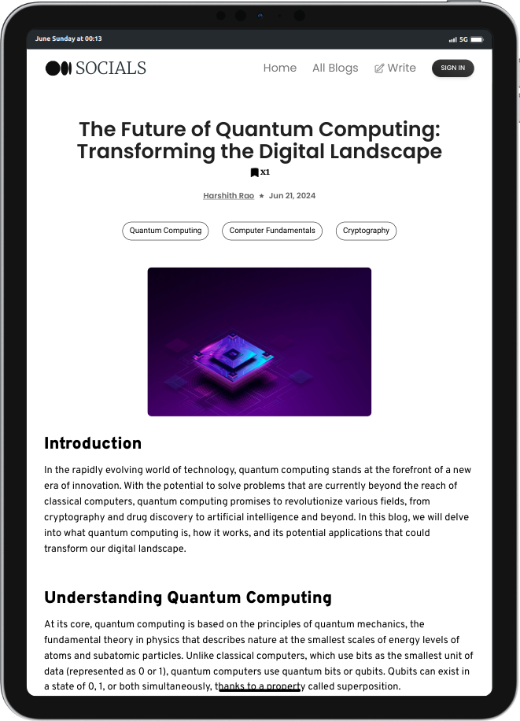

# SOCIALS

Socials is a dynamic blogging platform that combines the essence of social media with the power of content creation. Designed for writers, thinkers, and creators of all kinds, Socials offers a seamless experience to share and explore diverse stories, expertise, and insights on any topic.


## Features

- **Advanced AI Integration:** Leverage Google Gemini for AI support, enabling powerful content generation and editing assistance
- **Serverless Backend:** Built on Cloudflare Workers using Hono JS, ensuring scalable and performant backend operations.
- **Efficient Database Management:** Utilizes Prisma with connection pooling for fast and reliable database operations.
- **Customization:** Tailor your blog with ease using Quill.js for intuitive content editing and styling.


## Tech Stack

**Client:** React, React-Router, Redux, TailwindCSS, Google Gemini API, AWS S3, Quill.js

**Server:** Hono, Prisma, PostgreSQL

- React in the frontend.
- Cloudflare workers in the backend.
- Zod as the validation library, type inference for the frontend types.
- Typescript as the language in backend.
- Prisma as the ORM, with connection pooling using Accelerate.
- PostgreSQL as the database.
- JWT for authentication.

## Run Locally

Clone the project

```bash
  git clone https://github.com/harshithrao07/socials
```

Navigate to both Client and Server

```bash
  cd backend
```

```bash
  cd frontend
```

Install dependencies

```bash
  npm install
```

Start the server

```bash
  npm run start
```


## Screenshots





## Authors

- [Github](https://www.github.com/harshithrao07)
- [Linkedin](https://www.linkedin.com/in/harshithrao07/)
- [Portfolio](https://harshithrao.vercel.app/)
- [Instagram](https://www.instagram.com/harshith._.rao/)

